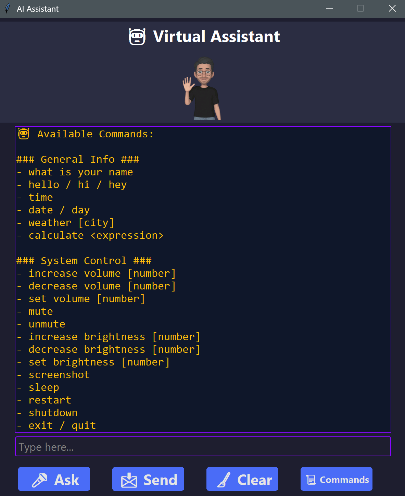

# 🤖 Virtual Assistant (Python 3.10)


A fully customizable **desktop virtual assistant** with a **modern Tkinter GUI**.  
It combines **speech recognition, text-to-speech, system automation, and web tools** to help you control your PC, fetch information, and interact naturally.  

---

## ✨ Features

### 🎤 Input
- **Voice Commands** → Powered by `speech_recognition` and `sounddevice`.  
- **Text Commands** → Styled input box with placeholder & focus effects.  

### 💬 Output
- **Chat-like Interface** → All conversations shown in a styled text widget.  
- **Color-coded Messages** → Blue for user, Yellow for assistant.  
- **Auto-scroll** → Always scrolls to the latest message.  

### 🖥️ System Control
- 🔊 **Volume Control** → Increase, decrease, or set to a specific value via `pycaw`.  
- 💡 **Brightness Control** → Adjust brightness incrementally or set exact value with `screen-brightness-control`.  
- 📂 **Window Management** → Switch, minimize, maximize, or close apps with `pygetwindow` & `pyautogui`.  

### 🌐 Information & Entertainment
- 📖 **Wikipedia Search**  
- 🌍 **Web Search** (via `requests_html`)  
- 🎵 **Play Music** → Opens YouTube Music (plays first result if you specify a song).  
- 😂 **Jokes** → Random tech jokes from `pyjokes`.  
- 📅 **Date & Time** → Get system time & date.  
- 📌 **Custom Commands** → Extend functionality via `action.py`.  

### 🎨 GUI Highlights
- Modern **rounded gradient buttons** with hover effects.  
- Styled **input fields** with placeholder support.  
- Assistant **avatar image** (replaceable with your own).  
- Command list directly viewable inside the chat box.  
- Responsive **grid-based layout**.  

---

## 📦 Requirements

- Python **3.10.11** (recommended version)  
- Install dependencies:  
```bash
pip install -r requirements.txt
````

### Main Dependencies

* `tkinter` → GUI (usually comes pre-installed with Python)
* `speechrecognition`, `sounddevice`, `soundfile` → Voice input
* `pyttsx3` → Text-to-speech
* `requests_html`, `wikipedia`, `pyjokes` → Web info & fun
* `pycaw`, `screen-brightness-control`, `pyautogui`, `pygetwindow` → System control
* `Pillow` → Image handling for avatar
* **Custom modules:** `speech2text.py`, `action.py`, `speak.py`

---

## 🚀 Getting Started

Clone the repository:

```bash
https://github.com/MGCinder04/virtual_AI_Assistant.git
cd virtual-assistant
```

Install dependencies:

```bash
pip install -r requirements.txt
```

Run the assistant:

```bash
python gui.py
```

---

## 🧑‍💻 Usage Guide

### GUI Overview

* 🎤 **Ask Button** → Start voice recognition
* 📩 **Send Button** → Send typed text command
* 🧹 **Clear Button** → Clear the chat history
* 📜 **Commands Button** → Show available commands list

### Keyboard Shortcuts

* **Enter** → Send message
* **Esc** → (Optional) Can be bound to exit

### Example Commands

* `"Open YouTube"`
* `"Play Bohemian Rhapsody"`
* `"Tell me a joke"`
* `"What's the time?"`
* `"Search Python programming on Wikipedia"`
* `"Increase volume by 20"`
* `"Set brightness to 70"`

---

## 📂 Project Structure

```
virtual-assistant/
│── gui.py                  # Main Tkinter GUI
│── action.py               # Command handling logic
│── speech2text.py          # Voice recognition logic
│── speak.py                # Text-to-speech helper
│── assistant_commands.txt  # List of supported commands
│── requirements.txt        # Python dependencies
│── image/
│   └── assistant.png       # Assistant avatar
└── README.md               # Project documentation
```

---

## 🔧 Extending the Assistant

You can easily add new commands by editing **`action.py`**.

**Example: Add a Weather Command**

```python
elif "weather" in query:
    city = query.split("in")[-1].strip()
    return f"Fetching weather for {city}..."
```

Then update **`assistant_commands.txt`** to document it.

---

## 📸 Screenshots



---

## 🛠️ Troubleshooting

* **Microphone not working?**
  Check your default audio input device and ensure permissions are allowed.

* **Assistant window too small?**
  Adjust `root.geometry("600x700")` in `gui.py`.

* **Dependencies not installing?**
  Ensure you’re using **Python 3.10.11** and a clean virtual environment.

---

## 🙌 Credits

* Built with ❤️ using **Python, Tkinter, and open-source libraries**.
* Inspired by the idea of creating a **Jarvis-like personal assistant**.

```
